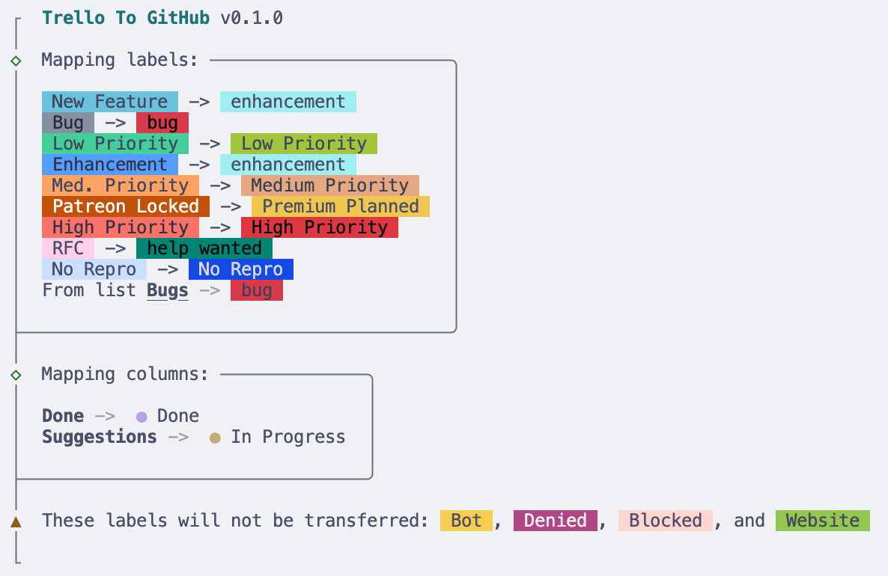

# Trello-to-GitHub CLI

A command-line tool to transfer all cards from a Trello board into GitHub Issues!

## Features

- Exports Trello cards as GitHub issues in any repository
- Preserves card titles, descriptions, and labels
- Maps Trello lists to GitHub issue labels or milestones
- Interactive or fully automated modes
- Dry-run mode for previewing the migration



## Installation

Clone this repo and install dependencies:

```bash
git clone https://github.com/piemot/trello-to-github.git
cd trello-to-github
bun install
```

## Usage

### Basic command

```bash
trello-to-github \
  --trello-key <TRELLO_API_KEY> \
  --trello-token <TRELLO_API_TOKEN> \
  --trello-board <TRELLO_BOARD_ID> \
  --trello-export <TRELLO_EXPORT_FILE>
  --github-token <GITHUB_TOKEN> \
  --github-repo <OWNER/REPO>
```

### Options

| Option            | Description                                         | Required |
| ----------------- | --------------------------------------------------- | -------- |
| `--trello-key`    | Your Trello API key                                 | Yes      |
| `--trello-token`  | Your Trello API token                               | Yes      |
| `--trello-board`  | The Trello board ID to export                       | Yes      |
| `--github-token`  | Your GitHub personal access token                   | Yes      |
| `--github-repo`   | Target GitHub repo (format: owner/repo)             | Yes      |
| `--label-mapping` | Optional path to JSON file for custom label mapping | No       |
| `--dry-run`       | Preview what will be transferred (no changes made)  | No       |
| `--interactive`   | Launch interactive prompt for options               | No       |
| `--help`          | Show CLI help                                       | No       |

### Example

```bash
trello-to-github \
  --trello-key 123abc \
  --trello-token abc123tok \
  --trello-board 1a2b3c4d \
  --github-token ghp_abcdef123456 \
  --github-repo piemot/awesome-project \
  --dry-run
```

## Notes

- For Trello API credentials, see [Getting your Trello API key and token](https://trello.com/app-key).
- For GitHub tokens, generate a [personal access token](https://github.com/settings/tokens) with `repo` scope.
- Large boards may take several minutes to transfer.

## Contribution

PRs welcome! Please open issues for feature requests or bugs.

## License

MIT

---

_This tool is not affiliated with Trello or GitHub._
